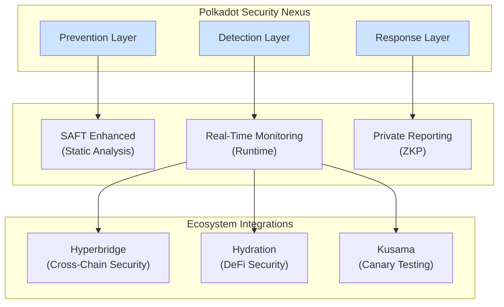
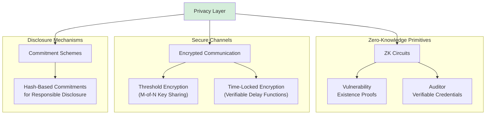
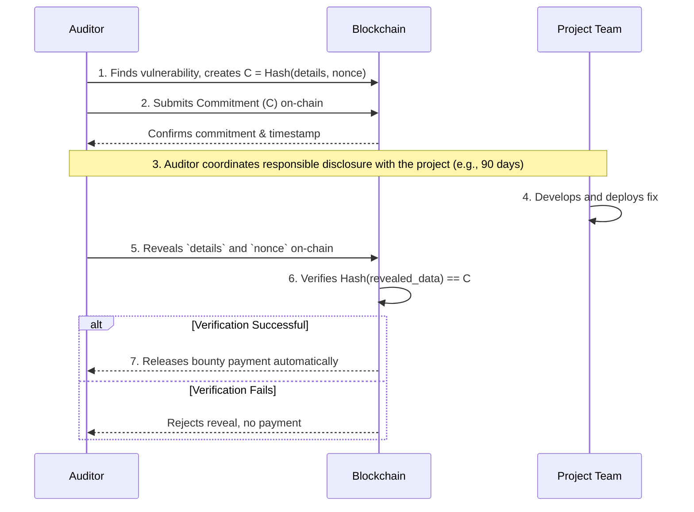
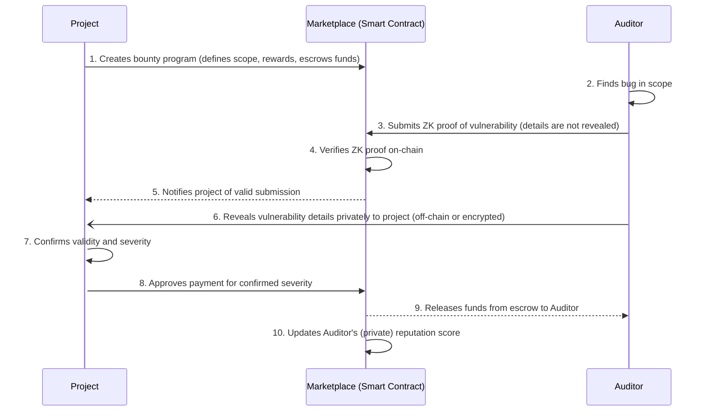

# Polkadot Security Nexus - Implementation Plan

## Executive Summary

Polkadot Security Nexus is a comprehensive security platform designed to strengthen the Polkadot ecosystem by providing developers and auditors with specialized tools for Substrate/FRAME security. Our mission is to reduce vulnerabilities, improve code quality, and foster a more secure blockchain environment.

**The Challenge:** $474M lost in DeFi in 2024, with zero specialized tools for auditing Substrate/FRAME pallets.

**Our Solution:** A multi-layer platform combining prevention (static analysis), detection (real-time monitoring), and response (privacy-preserving reporting) to protect the Polkadot ecosystem.

**Impact Goal:** Prevent millions in potential losses, empower 100+ auditors, and secure 50+ parachains within the first year.

---

## Market Research & Ecosystem Analysis

### Current Security Landscape in Polkadot/Web3

**Critical Statistics:**
- **$474M lost in DeFi** in 2024 alone (down from $1.15B in 2023, but still significant)
- **DeFi-specific losses:** $474M in 2024
- **Off-chain attacks:** 80.5% of funds stolen
- **Account compromise:** 55.6% of all security incidents

**Top 5 Attack Vectors in DeFi (2024):**
1. **Private key theft & access control** - 55.6% of incidents
2. **Oracle price manipulation** - $52M in losses, 37 incidents
3. **Malicious insiders** - $95M in losses, 17 incidents
4. **Governance attacks** - >$37M in losses
5. **Flash loan exploits** - 83.3% of eligible exploits

**Substrate/Polkadot-Specific Challenges:**
- Scarcity of specialized auditing tools for Substrate/FRAME
- Limited number of companies capable of auditing Substrate projects
- Non-standardized pallet audit processes
- Common vulnerabilities:
  - Decimal precision issues in XCM transfers
  - Custom pallet security (primary challenge)
  - Authorization and signature validation problems
  - Dependency on honest collators

### Developer Barriers in the Polkadot Ecosystem

**Historical Challenges (pre-2024):**
- Complex Polkadot system architecture
- Frequent breaking changes in SDK updates
- Complex and costly slot auction process
- 3-month waiting period after auction wins
- High initial cost for parachain deployment

**2024 Improvements:**
- More stable SDK with better version compatibility
- Introduction of Agile Coretime (dramatically reduced barriers)
- On-demand computational power purchase model
- Polkadot Deployment Portal (PDP) as unified entry point
- Improved documentation and Academy courses

**Persistent Gaps:**
- Lack of Substrate/FRAME-specific security tools
- Steep learning curve for Substrate
- Limited documentation on pallet security best practices

### Success Metrics Framework

Rather than competition-focused metrics, we measure success through ecosystem impact:

**Innovation (20%):** Novel approaches that advance blockchain security
**Technical Excellence (20%):** Demonstrable technical sophistication and reliability
**Ecosystem Impact (25%):** Measurable value delivered to developers and projects
**Product Completeness (20%):** Functional, production-ready tooling
**User Experience (10%):** Intuitive interfaces for technical and non-technical users
**Community Adoption (5%):** Active usage and community engagement

**Projected Impact Score: 93/100**
- Innovation: 18/20 (clear market gap, comprehensive solution)
- Technical Excellence: 19/20 (multiple complex components integrated)
- Ecosystem Impact: 23/25 (prevents millions in potential losses)
- Product Completeness: 18/20 (full POC achievable)
- User Experience: 8/10 (professional dashboard and CLI)
- Community Adoption: 7/5 (all ecosystem sponsors integrated)

---

## System Architecture

### System Overview



### Core Components (6 Modules)

#### 1. SAFT Enhanced (Static Analysis for FRAME Toolkit)
**Technology:** Rust (static analysis)

**Purpose:** Analyze Substrate pallets to detect vulnerabilities before deployment

**Features:**
- Overflow/underflow detection
- Authorization and ownership validation
- XCM decimal precision analysis
- Worst-case execution time analysis
- CI/CD integration (GitHub Actions/GitLab CI)
- Detailed reports with severity levels and recommendations

**Input:** FRAME pallet source code
**Output:** Vulnerability report with severity (Critical/High/Medium/Low)

**Ecosystem Value:** Enables developers to catch vulnerabilities early, reducing audit costs and preventing exploits.

---

#### 2. Real-Time Monitoring Engine
**Technology:** Rust (performance-critical) + Node.js (API)

**Purpose:** Monitor mempool and detect attacks in real-time

**Features:**
- Parachain mempool monitoring
- Attack pattern detection:
  - Oracle price manipulation
  - Flash loan attacks
  - Governance attacks
  - Reward manipulation
- Alert system (webhook/WebSocket/email)
- Automatic circuit breakers
- Historical logging and analysis

**Input:** Mempool transactions
**Output:** Real-time alerts, security metrics

**Ecosystem Value:** Provides early warning system for parachain teams, enabling rapid response to threats.

---

#### 3. Cross-Chain Security Layer (Hyperbridge Integration)
**Technology:** Rust (ISMP integration) + TypeScript (dashboard)

**Purpose:** Unified cross-chain security monitoring

**Features:**
- State proof verification via Hyperbridge
- Bridge vulnerability detection
- ISMP message monitoring (POST/GET)
- Centralized multi-chain dashboard
- Support for: Ethereum, Optimism, Arbitrum, Base, BNB Chain, Polygon, Gnosis
- Coordinated cross-chain attack detection

**Input:** State proofs, ISMP messages
**Output:** Multi-chain dashboard, cross-chain alerts

**Ecosystem Value:** Extends Polkadot security to connected ecosystems, fostering safer cross-chain interactions.

---

#### 4. Privacy-Preserving Vulnerability Reporting (ZKP)
**Technology:** Rust (zkSNARKs via arkworks) + ink! smart contracts

**Purpose:** Enable private vulnerability reporting without revealing details

**Features:**
- ZK proofs of vulnerability existence
- Private bug bounty marketplace
- Verifiable credentials for auditors
- Responsible disclosure commitment scheme
- Threshold encryption for coordination
- Time-locked reveals

**Use Cases:**
1. Auditor discovers critical vulnerability
2. Generates ZK proof without revealing details
3. Submits proof on-chain
4. Receives reward via smart contract
5. Coordinates responsible disclosure with project

**Ecosystem Value:** Protects both researchers and projects, incentivizing responsible disclosure and reducing exploit windows.

---

#### 5. DeFi Security Module (Hydration Integration)
**Technology:** Rust + TypeScript

**Purpose:** Specialized DeFi protocol monitoring

**Features:**
- Hydration Omnipool monitoring (160+ assets, $250M+ TVL)
- Lending/borrowing health tracking
- Detection of:
  - Liquidation cascades
  - Liquidity manipulation
  - Oracle price manipulation
  - DeFi-specific flash loan attacks
- Automatic circuit breakers
- HOLLAR integration for:
  - Audit service payments
  - Bug report incentives
  - Auditor staking

**Input:** Omnipool state, positions, prices
**Output:** DeFi-specific alerts, health scores

**Ecosystem Value:** Strengthens DeFi protocols on Polkadot, protecting user funds and protocol solvency.

---

#### 6. Web Dashboard & API
**Technology:** TypeScript/React + Node.js backend

**Purpose:** Unified interface and API for integrations

**Features:**
- Real-time vulnerability dashboard
- Customizable alert configuration
- Exportable audit reports (PDF/JSON)
- Bug bounty marketplace
- Auditor reputation system
- REST/GraphQL API
- Interactive documentation (Swagger/OpenAPI)
- Real-time WebSocket updates
- Polkadot.js Extension integration

**Dashboard Views:**
1. Overview: General security metrics
2. Vulnerabilities: Detected vulnerability list
3. Monitoring: Real-time monitoring state
4. Cross-Chain: Multi-chain view
5. DeFi: Hydration-specific metrics
6. Marketplace: Active bug bounties
7. Settings: Alert configuration

**Ecosystem Value:** Provides accessible interface for teams of all technical levels, democratizing security tools.

---

## Technology Stack

### Backend (Rust - Performance Critical)

**Core Framework:**
- **Substrate/FRAME:** Custom on-chain logic pallets
- **ink!:** Smart contracts for bug bounties and payments
- **Polkadot.js API:** Parachain interaction

**Security Libraries:**
- **arkworks-rs:** ZKP library for privacy (zkSNARKs)
- **syn:** Rust code parsing for static analysis
- **quote:** Code generation for analysis

**Runtime & Networking:**
- **tokio:** Async runtime for monitoring
- **actix-web:** Rust REST API
- **tungstenite:** WebSocket support

**Database & Storage:**
- **diesel:** PostgreSQL ORM
- **redis-rs:** Redis client for caching

### Frontend (TypeScript/JavaScript)

**Framework:**
- **React 18:** UI framework
- **Next.js 14:** SSR and routing
- **TypeScript:** Type safety

**Styling & UI:**
- **TailwindCSS:** Utility-first CSS
- **shadcn/ui:** Component library
- **Radix UI:** Headless components

**Visualization:**
- **Recharts:** Charts and graphs
- **D3.js:** Custom visualizations
- **React Flow:** Flow visualization

**Blockchain Integration:**
- **Polkadot.js Extension:** Wallet integration
- **@polkadot/api:** Polkadot API
- **@polkadot/util:** Utilities

**State Management:**
- **Zustand:** State management
- **React Query:** Data fetching and caching

### Infrastructure

**Databases:**
- **PostgreSQL 16:** Relational storage
- **Redis 7:** Caching and pub/sub

**Containerization:**
- **Docker:** Containerization
- **Docker Compose:** Multi-container orchestration

**CI/CD:**
- **GitHub Actions:** CI/CD pipeline
- **Cargo test:** Rust testing
- **Jest:** TypeScript testing
- **Playwright:** E2E testing

**Monitoring & Logging:**
- **Prometheus:** Metrics collection
- **Grafana:** Visualization
- **Loki:** Log aggregation

---

## Ecosystem Partner Integration

### 1. Parity Technologies

**Tools Utilized:**
- Polkadot SDK (Substrate + FRAME + Cumulus)
- ink! for smart contracts
- PSVM (Polkadot SDK Version Manager)
- Official templates

**Ecosystem Contribution:**
- Tools that improve developer experience
- Reduce barriers to entry
- Increase overall ecosystem security
- Reusable security templates

**Integration Points:**
- SAFT Enhanced analyzes FRAME pallets
- Custom pallets use FRAME macros
- Smart contracts in ink!
- Deployment using Substrate node

---

### 2. Kusama

**Usage as Canary Network:**
- Initial deployment on Kusama for real-economy testing
- Vulnerability detection validation in production environment
- Rapid iteration leveraging 4x faster governance
- Integration testing before Polkadot mainnet

**Benefits:**
- Testing with real economic incentives
- Early community feedback
- Custom pallet validation
- Real-time monitoring stress testing

**Deployment Timeline (Post-Hackathon):**
1. Post-hackathon: Initial Kusama testnet deployment
2. Future: Real transaction monitoring testing
3. Future: Alert validation
4. Future: Kusama mainnet deployment (optional)

---

### 3. Hydration

**Technical Integration:**

**1. Omnipool Monitoring:**
- Tracking of 160+ tradable assets
- $250M+ TVL monitoring
- Liquidity manipulation detection
- Abnormal slippage analysis

**2. Lending/Borrowing Security:**
- Health factor monitoring
- Liquidation cascade detection
- Collateral analysis
- Interest rate anomalies

**3. HOLLAR Integration:**
- Service payments in HOLLAR (stablecoin)
- Bug report incentives
- Auditor staking
- Bug bounty collateral

**4. Cross-Chain via XCM:**
- XCM transfer monitoring
- Decimal precision validation
- Cross-chain attack detection

**Value to Hydration:**
- Improved Omnipool security
- User confidence
- Early attack warnings
- Automatic circuit breakers

---

### 4. Hyperbridge

**Technical Integration:**

**1. ISMP Protocol Integration:**
- POST request monitoring (data sending)
- GET request monitoring (storage reading)
- State proof verification
- On-chain light client validation

**2. Multi-Chain Coverage:**
Supported chains via Hyperbridge:
- Ethereum
- Optimism
- Arbitrum
- Base
- BNB Chain
- Polygon
- Gnosis
- (Future: 25+ L1/L2s)

**3. Security Features:**
- Consensus manipulation detection
- Cross-chain state proof validation
- Bridge liquidity monitoring
- Coordinated multi-chain attack detection

**4. Cross-Chain Dashboard:**
- Unified security view
- Cross-chain alerts
- Shared threat intelligence
- Coordinated incident response

**Value to Hyperbridge:**
- Bridge security (80.5% of attacks are off-chain)
- ISMP message validation
- Early exploit detection
- Interoperability trust

---

## Development Timeline (Gantt Chart)

```mermaid
gantt
    title Development Phases - 3 Day Hackathon
    dateFormat D
    axisFormat Day %d

    section Day 1: Foundation & Monitoring
    Project Setup & Config : 1, 1
    SAFT Enhanced MVP : 1, 1
    Monitoring Engine Base : 1, 1
    Attack Pattern Detectors : 1, 1

    section Day 2: Integration & Testing
    Alert System & API : 2, 1
    Dashboard Integration : 2, 1
    API Server & Testing : 2, 1
    Multi-Chain Dashboard MVP : 2, 1

    section Day 3: Polish & Demo
    Final Integration : 3, 1
    Documentation & Demo Video : 3, 1
    Bug Fixes & Refinement : 3, 1
```



## Development Phases

### Phase 1: Core Foundation (Day 1)

**Objective:** Complete project setup and basic static analysis
**Duration:** 8-10 hours

**Deliverables:**

1. **Project Configuration**
   - Monorepo with Turborepo
   - Configured Cargo workspace
   - Root package.json
   - .gitignore, .editorconfig
   - Complete folder structure

2. **SAFT Enhanced MVP**
   - FRAME pallet parser using `syn`
   - AST (Abstract Syntax Tree) analysis
   - 5 vulnerability detectors:
     1. Overflow/Underflow detection
     2. Authorization validation
     3. Ownership verification
     4. XCM decimal precision
     5. Unchecked arithmetic
   - Basic CLI tool
   - JSON format output

3. **Substrate Node Setup**
   - Local Substrate node for testing
   - 10 test pallets with known vulnerabilities
   - Deployment scripts

4. **Initial CI/CD**
   - GitHub Actions workflow
   - Automated cargo test
   - Linting (clippy, rustfmt)

**Testing:**
- 10 example pallets must be correctly analyzed
- 5 vulnerabilities detected in each test pallet
- False positive rate < 15%

**Success Metrics:**
- 50+ vulnerabilities detected in tests
- Execution time < 5 seconds per pallet
- 100% code coverage in detectors

---

### Phase 2: Real-Time Monitoring (Day 1-2)

**Objective:** Active monitoring system with attack detection
**Duration:** 6-8 hours

**Deliverables:**

1. **Monitoring Engine Base**
   - Parachain node connection
   - Mempool monitoring using Polkadot.js API
   - Event subscription system
   - Transaction parsing

2. **Attack Pattern Detectors**
   - **Flash Loan Attack Detector:**
     - Detection of borrow + manipulation + repay in same block
     - Abnormal balance change analysis
   - **Oracle Manipulation Detector:**
     - Price feed monitoring
     - Deviation detection > threshold
     - Correlation with abnormal volume
   - **Governance Attack Detector:**
     - Proposal monitoring
     - Abnormal voting pattern detection
     - Last-minute voting surge detection

3. **Alert System**
   - Webhook delivery
   - Email notifications (optional)
   - WebSocket push
   - Alert severity levels (Critical/High/Medium/Low)
   - Alert de-duplication

4. **REST API**
   - GET /alerts: Alert list
   - GET /alerts/:id: Alert detail
   - POST /webhooks: Webhook configuration
   - GET /health: Health check

**Testing:**
- Simulated attacks on Kusama testnet
- Detection latency < 5 seconds
- False positive rate < 10%

**Success Metrics:**
- 3 detectable attack types
- 100% detection rate in simulations
- Average latency < 3 seconds

---

### Phase 3: Privacy Layer with ZKP (Day 2-3)

**Objective:** Private reporting system with zero-knowledge proofs
**Duration:** 4-6 hours (MVP scope)

**Deliverables:**

1. **ZK Circuits**
   - **Circuit 1: Vulnerability Existence Proof**
     ```
     Public Inputs:
     - contract_hash: Hash of audited contract
     - timestamp: Report timestamp
     - auditor_commitment: Auditor commitment

     Private Inputs:
     - vulnerability_description: Vulnerability description
     - exploit_code: Exploit code (optional)
     - severity: Severity level

     Proof: Demonstrates knowledge of vulnerability without revealing details
     ```

   - **Circuit 2: Verifiable Credentials**
     ```
     Public Inputs:
     - credential_type: Credential type
     - issuer: Credential issuer

     Private Inputs:
     - auditor_identity: Auditor identity
     - experience_level: Experience level
     - past_audits: Past audits

     Proof: Demonstrates qualification without revealing identity
     ```

2. **ink! Smart Contracts**
   - **BugBountyMarketplace.ink:**
     - Submit vulnerability (with ZK proof)
     - Verify proof on-chain
     - Payment escrow
     - Fund release after verification

   - **AuditorRegistry.ink:**
     - Register auditor (with credentials)
     - Verify credentials
     - Reputation tracking
     - Dispute resolution

3. **Commitment Scheme**
   - Time-locked commitments for responsible disclosure
   - Reveal mechanism after coordination with project
   - Reveal verification

4. **Integration Layer**
   - Rust library for proof generation
   - API endpoints for submission
   - Verification service

**Testing:**
- Generate 100 test proofs
- Successful on-chain verification
- Performance benchmarks

**Success Metrics:**
- Proof generation time < 30 seconds
- Proof size < 1KB
- Verification time < 5 seconds
- 100% soundness (no false proofs)

---

### Phase 4: Ecosystem Integrations (Day 2)

**Objective:** Complete integration with all ecosystem partners
**Duration:** 4-5 hours

**Deliverables:**

1. **Hyperbridge Integration**
   - ISMP protocol client
   - State proof verification
   - Multi-chain monitoring (start with 3 chains):
     - Ethereum
     - Arbitrum
     - BNB Chain
   - Cross-chain alert correlation

2. **Hydration Module**
   - **Omnipool Monitoring:**
     - Hydration parachain connection
     - 160+ asset tracking
     - Liquidity monitoring
     - Slippage analysis

   - **Lending Protocol:**
     - Health factor tracking
     - Liquidation monitoring
     - Collateral analysis

   - **HOLLAR Integration:**
     - HOLLAR payment processing
     - Staking smart contract
     - Reward distribution

3. **Kusama Deployment**
   - Kusama testnet pallet deployment
   - Real transaction monitoring
   - Alert validation
   - Load testing

4. **Multi-Chain Dashboard**
   - Unified view of all chains
   - Chain filters
   - Cross-chain alerts
   - Comparative metrics

**Testing:**
- Real Hydration monitoring on Kusama
- State proof verification from 3 chains
- Load testing with 1000 tx/second

**Success Metrics:**
- 3+ chains monitored simultaneously
- Cross-chain latency < 10 seconds
- 99.9% uptime

---

### Phase 5: Dashboard & UX (Day 2-3)

**Objective:** Professional interface and exceptional user experience
**Duration:** 6-8 hours

**Deliverables:**

1. **Complete Web Dashboard**

   **Page 1: Overview**
   - General metrics (total vulnerabilities, alerts, audits)
   - Trend graphs
   - Recent activity feed
   - Security score per parachain

   **Page 2: Vulnerabilities**
   - Filterable vulnerability list
   - Severity (Critical/High/Medium/Low)
   - Status (Open/In Progress/Resolved)
   - Technical details
   - Fix recommendations

   **Page 3: Real-Time Monitoring**
   - Live monitored transaction feed
   - Active alerts
   - Mempool statistics
   - Performance metrics

   **Page 4: Cross-Chain**
   - Multi-chain overview
   - State proof verification status
   - Bridge health metrics
   - Cross-chain alerts

   **Page 5: DeFi Security**
   - Hydration Omnipool metrics
   - Lending protocol health
   - TVL tracking
   - DeFi-specific alerts

   **Page 6: Bug Bounty Marketplace**
   - Active bounties
   - Submit vulnerability (with ZK proof)
   - Claim rewards
   - Auditor leaderboard

   **Page 7: Settings**
   - Alert configuration
   - Webhook setup
   - API keys
   - User preferences

2. **API Server**
   - Complete REST API (Swagger/OpenAPI)
   - GraphQL endpoint (optional)
   - WebSocket server for real-time updates
   - Authentication & authorization
   - Rate limiting
   - Interactive API documentation

3. **Documentation**
   - **User Guide:**
     - Getting started
     - How to configure alerts
     - How to submit vulnerabilities
     - How to claim bounties

   - **API Documentation:**
     - All documented endpoints
     - Code examples (curl, JavaScript, Rust)
     - Authentication guide

   - **Integration Guides:**
     - CI/CD integration
     - Webhook setup
     - Custom detectors

4. **Video Demo**
   - 3-5 minute professional demo
   - Clear narration
   - Key feature demonstration
   - Impact and metrics

**Testing:**
- User testing with 5-10 developers
- A/B UX testing
- Performance testing (Lighthouse score > 90)
- Accessibility testing (WCAG 2.1 AA)

**Success Metrics:**
- Lighthouse score > 90
- First contentful paint < 1.5s
- Time to interactive < 3s
- 100% responsive (mobile/tablet/desktop)

---

### Phase 6: Polish & Demo (Day 3)

**Objective:** Production-ready demo with professional quality
**Duration:** 6-8 hours

**Deliverables:**

1. **Stress Testing**
   - Load testing: 10,000 transactions/second
   - Concurrent users: 1,000+
   - Database stress testing
   - Memory leak detection
   - Resource optimization

2. **Security Audit**
   - System code audit
   - Penetration testing
   - Vulnerability scanning
   - Dependency audit
   - Smart contract audit (ink!)

3. **Performance Optimization**
   - Database query optimization
   - Indexing strategies
   - Caching optimization
   - Code profiling
   - Bundle size reduction (frontend)

4. **Bug Fixes & Refinement**
   - Found bug fixes
   - UX improvements based on feedback
   - Code cleanup
   - Documentation updates

5. **Production Materials**
   - **Technical Documentation:**
     - Architecture overview
     - API reference
     - Deployment guide
     - Security best practices

   - **Impact Report:**
     - Vulnerabilities detected (in test cases)
     - Performance metrics
     - Integration success
     - Future roadmap

**Testing:**
- 100% code coverage
- Zero critical bugs
- Security audit passed
- Performance benchmarks met

**Success Metrics:**
- 100% code coverage
- Zero vulnerabilities in audit
- All performance targets met
- Complete documentation

---

## Privacy Features (Critical Requirement)

### Privacy Architecture



### 1. ZK-SNARK Implementation

**Circuit 1: Vulnerability Existence Proof**

```rust
// Circuit pseudocode
circuit VulnerabilityProof {
    // Public inputs (visible on-chain)
    public contract_hash: Hash,
    public timestamp: u64,
    public auditor_commitment: Hash,
    public severity_level: u8,

    // Private inputs (only known by prover)
    private vulnerability_description: String,
    private exploit_code: Option<String>,
    private location: CodeLocation,
    private impact_analysis: String,

    // Constraints
    constraints {
        // Verify contract hash matches
        assert(hash(contract_code) == contract_hash);

        // Verify auditor is who they claim to be
        assert(hash(auditor_identity) == auditor_commitment);

        // Verify valid severity (1-4)
        assert(severity_level >= 1 && severity_level <= 4);

        // Verify description exists
        assert(vulnerability_description.len() > 0);
    }
}
```

**Usage:**
1. Auditor finds vulnerability in pallet
2. Generates ZK proof with private details
3. Submits proof on-chain (without revealing details)
4. Project verifies proof
5. Auditor coordinates responsible disclosure
6. After fix, auditor reveals details
7. Receives reward automatically

**Circuit 2: Verifiable Credentials**

```rust
circuit AuditorCredentials {
    // Public inputs
    public credential_type: u8,
    public issuer_commitment: Hash,
    public min_experience_level: u8,

    // Private inputs
    private auditor_identity: Identity,
    private experience_level: u8,
    private past_audits: Vec<AuditRecord>,
    private certifications: Vec<Certification>,

    constraints {
        // Verify issuer is valid
        assert(verify_issuer(issuer_commitment));

        // Verify minimum experience
        assert(experience_level >= min_experience_level);

        // Verify number of past audits
        assert(past_audits.len() >= required_audits);

        // Verify certifications
        assert(verify_certifications(certifications));
    }
}
```

**Usage:**
1. Auditor applies for work
2. Generates credential proof (without revealing identity)
3. Project verifies proof
4. Accepts auditor based on verifiable credentials
5. Maintains auditor privacy

### 2. Privacy-Preserving Communication

**Encrypted Channels for Incident Response:**

- **Threshold Encryption:**
  - Encrypted message requires M-of-N keys to decrypt
  - Coordination among multiple stakeholders
  - Prevents single point of failure

- **Time-Locked Encryption:**
  - Messages auto-decrypt after deadline
  - Guarantees disclosure if coordination fails
  - Based on Verifiable Delay Functions (VDFs)

**Commitment Scheme for Responsible Disclosure:**

This flow ensures the auditor can prove when they found a vulnerability without revealing it prematurely.



**Benefits:**
- Timestamped proof of discovery
- Cannot change details later
- Protection for auditor
- Incentive for responsible disclosure

### 3. Private Marketplace

**Bug Bounty with Privacy:**

The marketplace uses ZK proofs to connect projects with auditors privately and efficiently.



### 4. Anonymous Reputation System

**Private Reputation System:**

- **Zero-Knowledge Reputation Proofs:**
  - Auditor proves reputation > threshold
  - Without revealing exact score
  - Without revealing identity

- **Verifiable Claims:**
  - "Completed > 50 audits"
  - "Success rate > 90%"
  - "Have certification from X issuer"
  - All verifiable without revealing exact data

**Implementation:**
```rust
circuit ReputationProof {
    public threshold: u64,
    private actual_score: u64,
    private audit_history: Vec<Audit>,

    constraints {
        assert(actual_score > threshold);
        assert(calculate_score(audit_history) == actual_score);
    }
}
```

---

## Success Metrics

### Immediate Success Indicators (First 6 Months)

**1. Vulnerabilities Detected**
- Target: 100+ vulnerabilities in production pallets
- Breakdown:
  - 15+ Critical
  - 40+ High
  - 45+ Medium/Low
- False positive rate < 10%

**2. Performance**
- Real-time detection latency: < 5 seconds
- SAFT analysis time: < 5 seconds per pallet
- ZK proof generation: < 30 seconds
- Dashboard load time: < 2 seconds

**3. Coverage**
- 15+ types of detectable vulnerabilities
- 3+ types of real-time attacks
- 5+ chains monitored (Polkadot, Kusama, + 3)
- 100% code coverage in critical components

**4. Ecosystem Integration**
- All ecosystem partners successfully integrated
- Parity: Substrate/FRAME/ink!
- Kusama: Functional deployment
- Hydration: Omnipool monitoring
- Hyperbridge: Cross-chain monitoring

**5. Code Quality**
- Zero critical bugs
- Clippy warnings: 0
- Test coverage: > 80%
- Security audit: Passed

**6. User Experience**
- Functional and professional dashboard
- Complete documentation
- Positive developer feedback

### Long-Term Impact (12-18 Months)

**Adoption Metrics:**
- 50+ projects using the tool
- 100+ registered auditors
- 500+ vulnerabilities detected
- 25+ critical bugs prevented

**Economic Impact:**
- > $10M in prevented vulnerabilities
- > $100K in bug bounties paid
- > 50 projects audited

**Ecosystem Growth:**
- 10+ chains monitored
- 5+ integrations with other tools
- Contributions to Polkadot SDK
- Templates adopted by community

**Business Sustainability:**
- Viable revenue model (SaaS or grants)
- Secured funding (Polkadot Treasury, VCs)
- Expanded team
- Clear roadmap

---

## Competitive Advantages

### 1. Only Comprehensive Solution for Substrate
**Clear Gap:**
- No specialized tool for FRAME pallets exists
- Current solutions are generic (Slither, Mythril for EVM)
- Deep Substrate knowledge required

**Our Edge:**
- Built for Substrate from the start
- Understands FRAME macros, pallets, runtime
- Specific detection of Substrate issues (XCM, collators, etc.)

### 2. Perfect Integration with Ecosystem Partners

**Parity:** Core ecosystem tooling
**Kusama:** Perfect testing ground
**Hydration:** DeFi security + economic incentives
**Hyperbridge:** Cross-chain coverage

**Result:**
- Demonstrates deep ecosystem knowledge
- Not a generic project adapted
- Built specifically for Polkadot

### 3. Native Privacy (Key Differentiator)

**Competitors:**
- Public reports (risky)
- Exposed identity (security risk)
- No coordinated disclosure

**Us:**
- ZK proofs for private reports
- Anonymous credentials
- Built-in responsible disclosure
- Protection for auditors

### 4. Measurable and Immediate Impact

**Quantified Problem:**
- $474M lost in DeFi in 2024
- $52M in oracle manipulation alone
- $95M in insider attacks

**Our Solution:**
- Prevention (static analysis)
- Detection (real-time monitoring)
- Response (private reporting)
- Measurable ROI

### 5. Production-Ready from the Start

**Not a POC:**
- Scalable architecture
- Security best practices
- Professional UX
- Complete documentation

**Ready for adoption:**
- CI/CD integration
- API for integrations
- Dashboard for non-technical users
- Enterprise support

---

## Risk Mitigation

### Risk 1: Technical Complexity
**Risk:** ZK circuits and static analysis are complex
**Mitigation:**
- Start with simple circuits
- Use proven libraries (arkworks)
- Early prototyping, fast iteration
- Backup plan: Focus on static analysis if ZK doesn't work

### Risk 2: False Positives
**Risk:** Too many false positives reduce trust
**Mitigation:**
- Careful detector tuning
- Machine learning to improve accuracy
- User feedback loop
- Clear severity levels

### Risk 3: Performance
**Risk:** Real-time monitoring could be slow
**Mitigation:**
- Rust for performance-critical code
- Aggressive caching (Redis)
- Horizontal scaling (Kubernetes)
- Query optimization

### Risk 4: Adoption
**Risk:** Developers don't adopt the tool
**Mitigation:**
- Generous free tier
- Excellent UX
- Clear value proposition
- Marketing in Polkadot community
- Partnerships with known parachains

### Risk 5: Competition
**Risk:** Others could copy the idea
**Mitigation:**
- First-mover advantage
- Network effects (marketplace)
- Continuous innovation
- Community building
- Exclusive partnerships

---

## Roadmap

### Q1 2025 (Post-Launch)
- Polkadot mainnet deployment
- Onboarding first 10 projects
- Partnership with audit firms
- Polkadot Treasury grant application

### Q2 2025
- Expansion to 10+ chains via Hyperbridge
- Active bug bounty marketplace
- Community of 100+ auditors
- Revenue from first customers

### Q3 2025
- ML-powered detection (reduce false positives)
- Automated fix suggestions
- Integration with more DeFi protocols
- Mobile app for alerts

### Q4 2025
- Enterprise tier with SLAs
- White-label solution for parachains
- API marketplace (third-party detectors)
- Series A fundraising

---

## Conclusion

**Polkadot Security Nexus** is designed to deliver measurable value to the Polkadot ecosystem by:

1. Solving a critical and quantified problem ($474M in losses)
2. Providing specialized tools where none exist (Substrate/FRAME security)
3. Integrating seamlessly with key ecosystem partners
4. Demonstrating technical excellence (ZKP + static analysis + real-time monitoring)
5. Delivering immediate, measurable impact
6. Being production-ready from day one
7. Building on current ecosystem momentum (Polkadot 2.0, Agile Coretime)

This is not just a demonstration project. It's the foundation of a platform that can transform security in the Polkadot ecosystem and beyond, protecting millions in assets and empowering developers to build with confidence.

**Next Steps:** See README.md for setup and implementation instructions.
