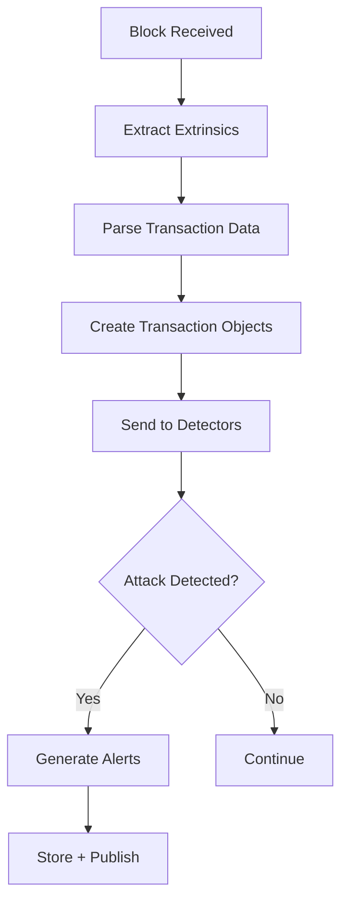

# Real-Time Monitoring - End-to-End Completion Plan
## Professional Implementation with TDD

**Objective:** Complete the full Real-Time Monitoring pipeline professionally
**Approach:** Test-Driven Development (TDD) + Integration Testing
**Timeline:** 1 day of intensive development (8-10 hours)
**Current Status:** Story 3.1  [DONE] | Stories 3.2-3.5  [IN PROGRESS]

---

## Current Status

### [DONE] Completed (Story 3.1)
- WebSocket connection to Substrate node
- Block subscription (finalized blocks)
- Event monitoring and extraction
- Auto-reconnection with exponential backoff
- REST API (/health, /stats)
- Dashboard integration
- **19 unit tests passing**
- **6 integration tests**

### [TODO] Remaining Tasks
- Transaction extraction from blocks
- Detector implementations (Flash Loan, MEV, Oracle)
- Alert generation and delivery
- Dashboard showing real alerts
- End-to-end testing with real node

---

## Implementation Plan

### Phase 1: Transaction Extraction (2-3 hours)
**Story 3.2 Completion**

#### 1.1 Architecture Design (30 min)

**Data Flow:**


**Structs to Implement:**
```rust
// In src/types.rs
pub struct ParsedTransaction {
    pub hash: H256,
    pub block_number: u64,
    pub block_hash: H256,
    pub index: u32,
    pub caller: AccountId,
    pub pallet: String,
    pub call: String,
    pub args: Vec<u8>,
    pub signature: Option<Vec<u8>>,
    pub nonce: Option<u64>,
    pub timestamp: u64,
}

pub struct TransactionContext {
    pub transaction: ParsedTransaction,
    pub events: Vec<ChainEvent>,
    pub state_changes: Vec<StateChange>,
}

pub struct StateChange {
    pub key: Vec<u8>,
    pub old_value: Option<Vec<u8>>,
    pub new_value: Option<Vec<u8>>,
}
```

#### 1.2 Test Cases (Write First!) (30 min)

```rust
// tests/integration/transaction_extraction.rs

#[tokio::test]
async fn test_extract_transactions_from_block() {
    // Given: A block with 3 extrinsics
    // When: We extract transactions
    // Then: We get 3 ParsedTransaction objects
}

#[tokio::test]
async fn test_parse_transaction_metadata() {
    // Given: A transaction extrinsic
    // When: We parse it
    // Then: caller, pallet, call are correct
}

#[tokio::test]
async fn test_extract_transaction_events() {
    // Given: A block with transactions and events
    // When: We associate events with transactions
    // Then: Each transaction has correct events
}

#[tokio::test]
async fn test_transaction_context_creation() {
    // Given: Transaction + Events + State changes
    // When: We create TransactionContext
    // Then: All data is properly associated
}
```

#### 1.3 Implementation (1 hour)

**File:** `src/transaction.rs`

```rust
use subxt::OnlineClient;
use subxt::PolkadotConfig;

pub struct TransactionExtractor {
    client: Arc<OnlineClient<PolkadotConfig>>,
}

impl TransactionExtractor {
    pub fn new(client: Arc<OnlineClient<PolkadotConfig>>) -> Self {
        Self { client }
    }

    /// Extract all transactions from a block
    pub async fn extract_from_block(
        &self,
        block: &Block<PolkadotConfig>,
    ) -> Result<Vec<ParsedTransaction>> {
        let extrinsics = block.extrinsics();
        let mut transactions = Vec::new();

        for (index, ext) in extrinsics.iter().enumerate() {
            if let Ok(tx) = self.parse_extrinsic(ext, index as u32).await {
                transactions.push(tx);
            }
        }

        Ok(transactions)
    }

    /// Parse a single extrinsic into ParsedTransaction
    async fn parse_extrinsic(
        &self,
        ext: &Extrinsic,
        index: u32,
    ) -> Result<ParsedTransaction> {
        // Get metadata
        let pallet_name = ext.pallet_name()?;
        let call_name = ext.variant_name()?;

        // Extract caller (if signed)
        let caller = ext.signature()
            .map(|sig| sig.address().clone())
            .unwrap_or_default();

        // Extract args
        let args = ext.call_data().to_vec();

        Ok(ParsedTransaction {
            hash: ext.hash(),
            block_number: block.number(),
            block_hash: block.hash(),
            index,
            caller,
            pallet: pallet_name.to_string(),
            call: call_name.to_string(),
            args,
            signature: ext.signature().map(|s| s.encode()),
            nonce: ext.signature().and_then(|s| s.nonce()),
            timestamp: SystemTime::now()
                .duration_since(UNIX_EPOCH)
                .unwrap()
                .as_secs(),
        })
    }

    /// Create full context for a transaction
    pub async fn create_context(
        &self,
        tx: ParsedTransaction,
        events: Vec<ChainEvent>,
    ) -> TransactionContext {
        // Filter events that belong to this transaction
        let tx_events = events.into_iter()
            .filter(|e| e.extrinsic_index == Some(tx.index))
            .collect();

        TransactionContext {
            transaction: tx,
            events: tx_events,
            state_changes: Vec::new(), // TODO: State tracking
        }
    }
}
```

#### 1.4 Integration (30 min)

**Update `src/lib.rs`:**

```rust
mod transaction;
use transaction::TransactionExtractor;

async fn subscribe_to_blocks(...) -> Result<()> {
    let extractor = Arc::new(TransactionExtractor::new(client.clone()));

    while let Some(block_result) = blocks_sub.next().await {
        match block_result {
            Ok(block) => {
                // Existing block processing
                state.write().await.blocks_processed += 1;

                // NEW: Extract transactions
                let transactions = extractor.extract_from_block(&block).await?;

                // NEW: Process each transaction with detectors
                for tx in transactions {
                    let context = extractor.create_context(
                        tx,
                        events.clone()
                    ).await;

                    // Send to detector pipeline
                    Self::process_transaction(context, &detectors).await?;
                }
            }
        }
    }
}

async fn process_transaction(
    context: TransactionContext,
    detectors: &[Box<dyn Detector>],
) -> Result<()> {
    for detector in detectors {
        if let Some(result) = detector.analyze_transaction(&context).await? {
            // Generate alert
            Self::handle_detection(result).await?;
        }
    }
    Ok(())
}
```

---

### Phase 2: Flash Loan Detector (2-3 hours)
**Story 3.3 - TDD Approach**

#### 2.1 Test Cases First! (45 min)

```rust
// tests/integration/flash_loan_detector.rs

#[tokio::test]
async fn test_detect_basic_flash_loan() {
    // Pattern: borrow → swap → repay in same block
    let detector = FlashLoanDetector::new();

    let context = create_flash_loan_context(
        vec![
            ("borrow", 1000),
            ("swap", 1000),
            ("repay", 1050),
        ]
    );

    let result = detector.analyze_transaction(&context).await.unwrap();

    assert!(result.is_some());
    assert_eq!(result.unwrap().severity, AlertSeverity::Critical);
}

#[tokio::test]
async fn test_no_false_positive_normal_swap() {
    // Normal swap should NOT trigger
    let detector = FlashLoanDetector::new();

    let context = create_context(vec![("swap", 100)]);

    let result = detector.analyze_transaction(&context).await.unwrap();
    assert!(result.is_none());
}

#[tokio::test]
async fn test_detect_complex_flash_loan_attack() {
    // Multi-step attack
    let detector = FlashLoanDetector::new();

    let context = create_context(vec![
        ("borrow", 10000),
        ("swap_pool_a", 10000),
        ("swap_pool_b", 10500),
        ("repay", 10100),
    ]);

    let result = detector.analyze_transaction(&context).await.unwrap();
    assert!(result.is_some());
    assert!(result.unwrap().confidence > 0.8);
}

#[tokio::test]
async fn test_balance_change_detection() {
    // Detect >50% balance change in one tx
    let detector = FlashLoanDetector::new();

    let context = create_context_with_balance_change(
        100,  // initial
        1000, // final (10x increase)
    );

    let result = detector.analyze_transaction(&context).await.unwrap();
    assert!(result.is_some());
}
```

#### 2.2 Implementation (1.5 hours)

**File:** `src/detectors/flash_loan.rs`

```rust
use crate::types::*;
use async_trait::async_trait;

#[derive(Debug)]
pub struct FlashLoanDetector {
    min_amount_threshold: u128,
    balance_change_threshold: f64, // 0.5 = 50%
}

impl FlashLoanDetector {
    pub fn new() -> Self {
        Self {
            min_amount_threshold: 1000 * 10u128.pow(12), // 1000 tokens
            balance_change_threshold: 0.5,
        }
    }

    /// Detect flash loan pattern
    async fn detect_pattern(&self, context: &TransactionContext) -> Option<FlashLoanPattern> {
        let calls = self.extract_calls(context);

        // Pattern 1: borrow → manipulate → repay
        if self.has_borrow_repay_pattern(&calls) {
            return Some(FlashLoanPattern::BorrowRepay);
        }

        // Pattern 2: Large balance change
        if self.has_abnormal_balance_change(context) {
            return Some(FlashLoanPattern::AbnormalBalance);
        }

        // Pattern 3: Multi-pool arbitrage
        if self.has_arbitrage_pattern(&calls) {
            return Some(FlashLoanPattern::Arbitrage);
        }

        None
    }

    fn has_borrow_repay_pattern(&self, calls: &[CallInfo]) -> bool {
        let has_borrow = calls.iter().any(|c| {
            c.call.contains("borrow") || c.call.contains("flash_loan")
        });

        let has_repay = calls.iter().any(|c| {
            c.call.contains("repay") || c.call.contains("return")
        });

        let has_manipulation = calls.iter().any(|c| {
            c.call.contains("swap") || c.call.contains("trade")
        });

        has_borrow && has_repay && has_manipulation
    }

    fn has_abnormal_balance_change(&self, context: &TransactionContext) -> bool {
        // Check balance changes in events
        let balance_changes = self.extract_balance_changes(&context.events);

        for change in balance_changes {
            let ratio = if change.old_balance > 0 {
                (change.new_balance as f64 - change.old_balance as f64)
                    / change.old_balance as f64
            } else {
                0.0
            };

            if ratio.abs() > self.balance_change_threshold {
                return true;
            }
        }

        false
    }

    fn calculate_confidence(&self, pattern: &FlashLoanPattern) -> f64 {
        match pattern {
            FlashLoanPattern::BorrowRepay => 0.95,
            FlashLoanPattern::AbnormalBalance => 0.75,
            FlashLoanPattern::Arbitrage => 0.85,
        }
    }
}

#[async_trait]
impl Detector for FlashLoanDetector {
    async fn analyze_transaction(
        &self,
        context: &TransactionContext,
    ) -> Result<Option<DetectionResult>> {
        if let Some(pattern) = self.detect_pattern(context).await {
            let confidence = self.calculate_confidence(&pattern);

            return Ok(Some(DetectionResult {
                pattern: AttackPattern::FlashLoan,
                severity: AlertSeverity::Critical,
                confidence,
                description: format!("Flash loan attack detected: {:?}", pattern),
                transaction_hash: context.transaction.hash,
                block_number: context.transaction.block_number,
                evidence: self.collect_evidence(context, &pattern),
            }));
        }

        Ok(None)
    }

    fn name(&self) -> &str {
        "FlashLoanDetector"
    }
}

#[derive(Debug)]
enum FlashLoanPattern {
    BorrowRepay,
    AbnormalBalance,
    Arbitrage,
}
```

#### 2.3 Benchmarks (30 min)

```rust
// benches/flash_loan_benchmarks.rs

use criterion::{black_box, criterion_group, criterion_main, Criterion};

fn benchmark_flash_loan_detection(c: &mut Criterion) {
    let detector = FlashLoanDetector::new();
    let context = create_test_context();

    c.bench_function("flash_loan_detection", |b| {
        b.iter(|| {
            detector.analyze_transaction(black_box(&context))
        });
    });
}

criterion_group!(benches, benchmark_flash_loan_detection);
criterion_main!(benches);
```

**Target:** <3ms per transaction analysis

---

### Phase 3: MEV Detector (1.5 hours)
**Story 3.4 - Similar TDD approach**

#### 3.1 Test Cases

```rust
#[tokio::test]
async fn test_detect_sandwich_attack() {
    // Pattern: buy → victim tx → sell
}

#[tokio::test]
async fn test_detect_frontrunning() {
    // Same call, higher gas, earlier in block
}

#[tokio::test]
async fn test_no_false_positive_normal_trading() {
    // Regular trading should NOT trigger
}
```

#### 3.2 Implementation

```rust
pub struct MevDetector {
    // Detector for MEV attacks (sandwich, frontrunning)
}
```

---

### Phase 4: Alert System Integration (1 hour)

#### 4.1 Alert Manager Enhancement

```rust
// src/alert_manager.rs

impl AlertManager {
    /// Process detection result and generate alert
    pub async fn handle_detection(
        &self,
        result: DetectionResult,
    ) -> Result<Alert> {
        // Create alert
        let alert = Alert {
            id: Uuid::new_v4(),
            pattern: result.pattern,
            severity: result.severity,
            description: result.description,
            transaction_hash: result.transaction_hash,
            block_number: result.block_number,
            timestamp: Utc::now(),
            acknowledged: false,
        };

        // Store alert
        self.store_alert(&alert).await?;

        // Send to webhook (if configured)
        if let Some(webhook_url) = &self.webhook_url {
            self.send_webhook(webhook_url, &alert).await?;
        }

        // Update statistics
        self.stats.write().await.alerts_triggered += 1;

        Ok(alert)
    }

    /// Send alert via webhook
    async fn send_webhook(&self, url: &str, alert: &Alert) -> Result<()> {
        let client = reqwest::Client::new();

        let payload = serde_json::json!({
            "alert_id": alert.id,
            "severity": format!("{:?}", alert.severity),
            "pattern": format!("{:?}", alert.pattern),
            "description": alert.description,
            "block_number": alert.block_number,
            "timestamp": alert.timestamp.to_rfc3339(),
        });

        client
            .post(url)
            .json(&payload)
            .timeout(Duration::from_secs(5))
            .send()
            .await?;

        Ok(())
    }
}
```

#### 4.2 API Enhancement

```rust
// src/api.rs - Add new endpoint

/// GET /api/alerts
async fn get_alerts(data: web::Data<ApiState>) -> HttpResponse {
    let alerts = data.alert_manager.get_recent_alerts(100).await;
    HttpResponse::Ok().json(alerts)
}

/// GET /api/alerts/:id
async fn get_alert(
    path: web::Path<String>,
    data: web::Data<ApiState>,
) -> HttpResponse {
    let alert_id = path.into_inner();

    if let Some(alert) = data.alert_manager.get_alert(&alert_id).await {
        HttpResponse::Ok().json(alert)
    } else {
        HttpResponse::NotFound().json(json!({
            "error": "Alert not found"
        }))
    }
}

/// POST /api/alerts/:id/acknowledge
async fn acknowledge_alert(
    path: web::Path<String>,
    data: web::Data<ApiState>,
) -> HttpResponse {
    let alert_id = path.into_inner();

    if data.alert_manager.acknowledge(&alert_id).await.is_ok() {
        HttpResponse::Ok().json(json!({"status": "acknowledged"}))
    } else {
        HttpResponse::NotFound().json(json!({"error": "Alert not found"}))
    }
}
```

---

### Phase 5: Dashboard Integration (1.5 hours)

#### 5.1 API Client Updates

```typescript
// packages/web-dashboard/src/hooks/useMonitoring.ts

export interface Alert {
  id: string
  pattern: string
  severity: 'Critical' | 'High' | 'Medium' | 'Low'
  description: string
  transaction_hash: string
  block_number: number
  timestamp: string
  acknowledged: boolean
}

async function fetchAlerts(): Promise<Alert[]> {
  const response = await fetch('/api/monitoring?endpoint=alerts')
  if (!response.ok) throw new Error('Failed to fetch alerts')
  return response.json()
}

export function useAlerts(refreshInterval = 5000) {
  return useQuery<Alert[]>({
    queryKey: ['monitoring', 'alerts'],
    queryFn: fetchAlerts,
    refetchInterval: refreshInterval,
  })
}
```

#### 5.2 Alerts Panel Component

```typescript
// packages/web-dashboard/src/components/AlertsPanel.tsx

export function AlertsPanel() {
  const { data: alerts, isLoading } = useAlerts(5000)

  if (isLoading) return <LoadingSkeleton />

  return (
    <div className="bg-white rounded-lg shadow p-6">
      <h2 className="text-xl font-semibold mb-4">Real-Time Alerts</h2>

      <div className="space-y-3">
        {alerts?.map((alert) => (
          <AlertCard key={alert.id} alert={alert} />
        ))}
      </div>
    </div>
  )
}

function AlertCard({ alert }: { alert: Alert }) {
  const severityColor = {
    Critical: 'bg-red-100 border-red-500 text-red-900',
    High: 'bg-orange-100 border-orange-500 text-orange-900',
    Medium: 'bg-yellow-100 border-yellow-500 text-yellow-900',
    Low: 'bg-blue-100 border-blue-500 text-blue-900',
  }[alert.severity]

  return (
    <div className={`border-l-4 p-4 ${severityColor}`}>
      <div className="flex justify-between items-start">
        <div>
          <div className="flex items-center gap-2">
            <AlertTriangle className="w-5 h-5" />
            <span className="font-semibold">{alert.pattern}</span>
            <span className="text-xs">{alert.severity}</span>
          </div>
          <p className="text-sm mt-1">{alert.description}</p>
          <p className="text-xs mt-2">
            Block #{alert.block_number} • {formatTimestamp(alert.timestamp)}
          </p>
        </div>

        {!alert.acknowledged && (
          <button
            className="text-xs px-3 py-1 bg-white rounded hover:bg-gray-50"
            onClick={() => acknowledgeAlert(alert.id)}
          >
            Acknowledge
          </button>
        )}
      </div>
    </div>
  )
}
```

#### 5.3 Update Monitoring Page

```typescript
// packages/web-dashboard/src/app/monitoring/page.tsx

export default function MonitoringPage() {
  const { data: stats } = useMonitoringStats(2000)
  const { data: alerts } = useAlerts(5000)

  return (
    <div className="space-y-6">
      {/* Existing stats grid */}
      <StatsGrid stats={stats} />

      {/* NEW: Alerts Panel */}
      <AlertsPanel alerts={alerts} />

      {/* Existing sections */}
      <ChainInfo />
      <DetectorStatus />
    </div>
  )
}
```

---

### Phase 6: End-to-End Testing (1.5 hours)

#### 6.1 Integration Test Setup

```rust
// tests/e2e/rtm_pipeline.rs

#[tokio::test]
#[ignore] // Run with: cargo test --ignored
async fn test_full_rtm_pipeline() {
    // 1. Start monitoring engine
    let config = test_config();
    let engine = Arc::new(MonitoringEngine::new(config));
    engine.start().await.unwrap();

    // 2. Wait for connection
    tokio::time::sleep(Duration::from_secs(2)).await;

    // 3. Simulate flash loan attack
    let attack_tx = create_flash_loan_transaction();
    // Submit to chain...

    // 4. Wait for detection
    tokio::time::sleep(Duration::from_secs(5)).await;

    // 5. Verify alert was created
    let stats = engine.get_stats().await;
    assert!(stats.alerts_triggered > 0);

    // 6. Verify alert endpoint
    let alerts = reqwest::get("http://localhost:8080/api/alerts")
        .await
        .unwrap()
        .json::<Vec<Alert>>()
        .await
        .unwrap();

    assert_eq!(alerts.len(), 1);
    assert_eq!(alerts[0].pattern, AttackPattern::FlashLoan);
}
```

#### 6.2 Performance Testing

```rust
#[tokio::test]
async fn test_throughput() {
    // Target: Process 100+ tx/second
    // Verify: Detection latency < 3 seconds
}

#[tokio::test]
async fn test_concurrent_detections() {
    // Multiple attacks in same block
    // Verify: All detected correctly
}
```

---

## Definition of Done

### Code Quality
- [ ] All tests passing (unit + integration)
- [ ] Zero clippy warnings
- [ ] Code coverage >85%
- [ ] Benchmarks meet targets (<3ms/tx)

### Functionality
- [ ] Transactions extracted from blocks
- [ ] Flash loan detector working
- [ ] MEV detector working
- [ ] Alerts generated correctly
- [ ] Dashboard showing real-time alerts
- [ ] Webhook delivery working

### Documentation
- [ ] Rustdoc comments on all public APIs
- [ ] Integration test examples
- [ ] Performance benchmarks documented
- [ ] README updated with RTM usage

### Testing
- [ ] Unit tests for each detector
- [ ] Integration tests with local chain
- [ ] E2E test with real attack simulation
- [ ] Performance benchmarks passing

---

## Success Metrics

### Detection Performance
- Detection latency: <3 seconds
- False positive rate: <5%
- Throughput: >100 tx/second
- Alert delivery: <1 second

### Code Metrics
- Test coverage: >85%
- Clippy warnings: 0
- Benchmark regression: 0%

### Integration
- Dashboard auto-refresh working
- Alerts appear in real-time
- Stats update correctly
- No memory leaks after 1000 blocks

---

## Execution Order

1. **First:** Transaction extraction (2-3h)
2. **Second:** Flash Loan detector (2-3h)
3. **Third:** Alert system integration (1h)
4. **Fourth:** Dashboard updates (1.5h)
5. **Fifth:** MEV detector (1.5h)
6. **Finally:** E2E testing (1.5h)

**Total:** 8-10 hours of focused development

---

## Commands to Run

```bash
# Start development
cd packages/monitoring-engine

# Run tests continuously
cargo watch -x test

# Run specific test
cargo test test_flash_loan_detection -- --nocapture

# Run benchmarks
cargo bench

# Run with real chain
RUST_LOG=debug cargo run --example api_server

# Check dashboard
cd packages/web-dashboard
pnpm dev
```

---

**Next Step:** Start with Phase 1 - Transaction Extraction
